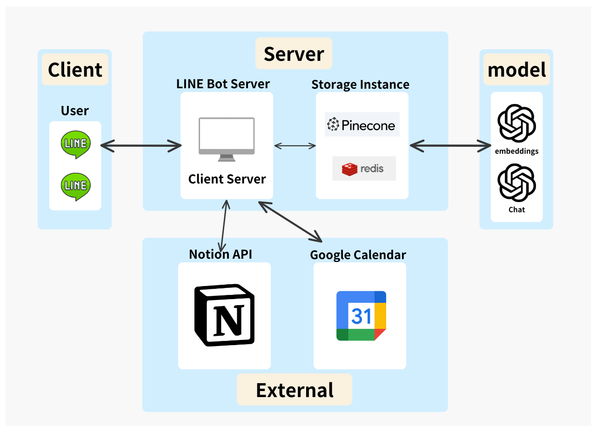
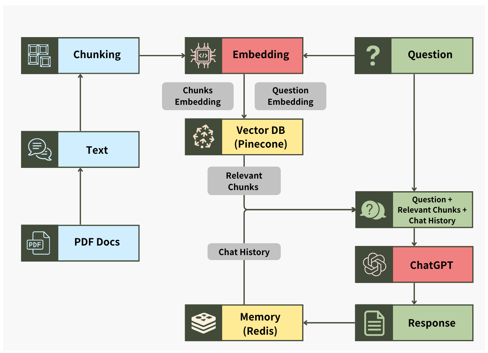

# Homework Helper

## Overview
The Homework Helper is a line bot homework assistant. We allow the user to upload their PDF files, and ask questions about the given PDFs. The server is connect to gpt-3.5-turbo, and will answer users with the answer the model generated. Also, we use RAG architecture to design this LLM application in order to chat with multiple large PDF files. Another feature of Homework Helper is that it can help you schedule the when to do which task of each homework. And can connect to Google Calendar or Notion to upload those schedule. Tech stack that Homework Helper used includes Python, LangChain, Pinecone, Redis, Linebot, Flask.

### Slides
Our presentation slides is available [here](https://www.canva.com/design/DAGHpu3fdEU/sRLo8Ic4eoEXkRZgUhkYoQ/edit?utm_content=DAGHpu3fdEU&utm_campaign=designshare&utm_medium=link2&utm_source=sharebutton).

### Application Architecture


### RAG Workflow


## Installation

### Python Environment

Python version: Python 3.12.3

```
pip install -r requirements.txt
```

### Environment Variables

Setup the following environment variables:

```
PINECONE_API_KEY
PINECONE_ENVIRONMENT
OPENAI_API_KEY
LINE_BOT_API_KEY
LINE_BOT_HANDLER
REDIS_HOST
REDIS_PASSWORD
REDIS_PORT
REDIS_URL
CLIENT_ID
PROJECT_ID
AUTH_URI
TOKEN_URI
AUTH_PROVIDER_URI
CLIENT_SECRET
REDIRECT_URIS
```

## Usage

Set up a HTTPS server environment and run
```
python3 app.py
```

## Experiment Result

### Test Method

Compare the cosine similarity of the pre-defined correct answer and the chatbot's response.
Test two different kinds of response: baseline and dataset.
Baseline is the initial response without knowledge database, while dataset do.

### Test Result 1

- Embedding Model: **`text-embedding-ada-002`**, from OpenAI
- Dimension: 1536
- Q8 is a summarization problem, so we didn’t compare its result with dataset

|  | Answer with Baseline | Answer with Dataset |
| --- | --- | --- |
| Q1 | 0.74399 | 0.79777 |
| Q2 | 0.85979 | 0.96244 |
| Q3 | 0.76734 | 0.76224 |
| Q4 | 0.89446 | 0.90952 |
| Q5 | 0.91698 | 0.92926 |
| Q6 | 0.95004 | 0.9515 |
| Q7 | 0.94494 | 0.95103 |
| Q8 | 0.90487 | x |
| Average | 0.87280125 | 0.8948228571 |

### Test Result 2

- Embedding Model: **`text-embedding-3-large`**, from OpenAI
- Dimension: 3072

|  | Answer with Baseline | Answer with Dataset |
| --- | --- | --- |
| Q1 | 0.20283 | 0.39998 |
| Q2 | 0.55193 | 0.88645 |
| Q3 | 0.45098 | 0.51579 |
| Q4 | 0.72985 | 0.79958 |
| Q5 | 0.73185 | 0.75635 |
| Q6 | 0.85057 | 0.85968 |
| Q7 | 0.84919 | 0.82876 |
| Q8 | 0.80526 | x |
| Average | 0.6465575 | 0.7209414286 |

### Test Result 3

- Embedding Model: **`all-MiniLM-L6-v2`**, from **`sentence-transformers`** library
- Dimension: 384

|  | Answer with Baseline | Answer with Dataset |
| --- | --- | --- |
| Q1 | 0.13268 | 0.27725 |
| Q2 | 0.56854 | 0.90632 |
| Q3 | 0.28917 |  0.27603 |
| Q4 | 0.71707 | 0.69645 |
| Q5 | 0.76864 | 0.8371 |
| Q6 | 0.84601 | 0.90124 |
| Q7 | 0.81213 | 0.78414 |
| Q8 | 0.70715 | x |
| Average | 0.60517375 | 0.6683614286 |
